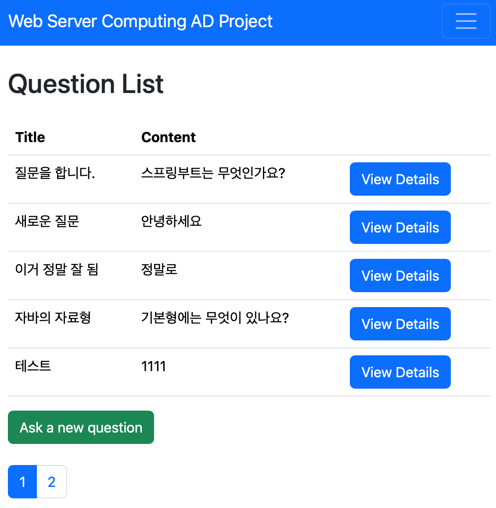
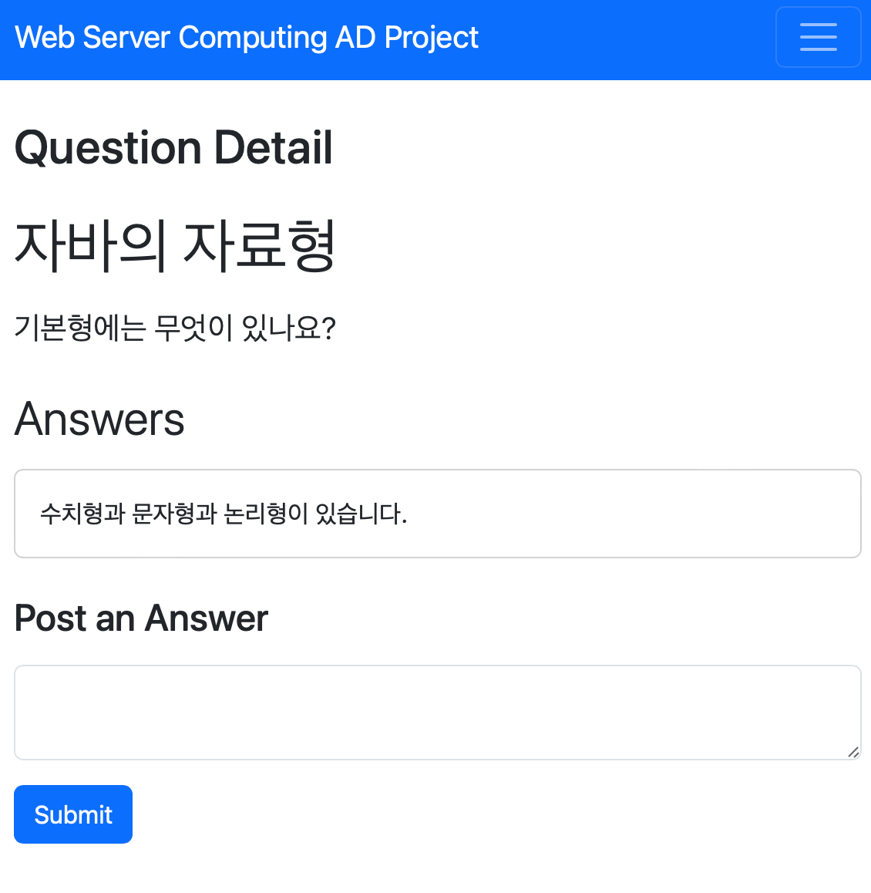

# Web Server Computing AD Project

This project is part of the Web Server Computing course at Kookmin University. 

It is a web application developed using Kotlin, Spring Boot. 

The application is designed to provide a platform for users to ask questions and receive answers.

 

## Features

The application provides the following features:

1. **Question List**: Displays a list of all the questions.
2. **Question Registration**: Allows users to register a new question.
3. **Question Details**: Displays the details of a selected question, answers.
4. **Answer Registration**: Allows users to register an answer to a selected question.
5. **Login**: Allows users to log in to the application.
6. **Logout**: Allows users to log out of the application.
7. **User Registration**: Allows new users to register an account.
8. **Paging**: Supports paging for the question list.
9. **Bootstrap Design**: Uses Bootstrap for CSS design.

## Setup

1. Run `docker-compose up` to start the MySQL database and run the `create_db_table.sql` file.
2. Run the `WebServerAdProjectApplication.kt` file to start the application.

## Dependencies

- Spring Boot Starter Web
- Spring Boot Starter Thymeleaf
- Spring Boot Starter Validation

- Spring Boot Starter JDBC, Data JPA
- MySQL Connector
- Bootstrap for CSS Design

## License

[Apache License 2.0](LICENSE)